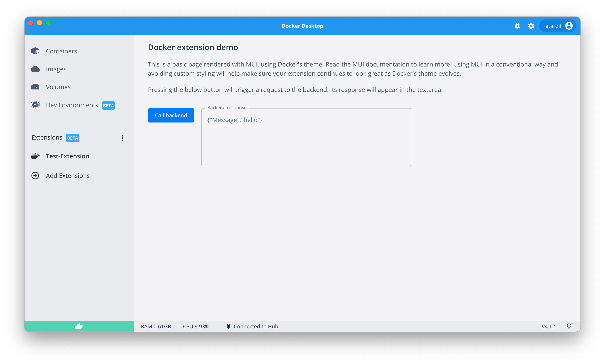

[](https://dockercommunity.slack.com/) 


[](https://stores.kotisdesign.com/swaggiveaway/redemption_code)


## Docker and Hacktoberfest 2022

Welcome to the [Hacktoberfest 2022](https://hacktoberfest.digitalocean.com/) with Docker Extensions!

Hacktoberfest is a month-long celebration of open-source projects, their maintainers, and the entire community of contributors. This event is all about giving back to the community and celebrating all things open source. We’d like to invite you to celebrate Hacktoberfest with us and contribute to the [Docker Community Extensions](https://www.docker.com/products/extensions/) .


## Table of Contents

- ❓[How to participate?](#how-to-participate)
- ✔️[List of Docker Extensions for Hacktoberfest 2022](#list-of-docker-extensions-for-hacktoberfest-2022)
- 🏗️[How to Create Your First Docker Extension](#how-to-create-your-first-docker-extension)
- 🗣️[Propose Your Docker Extension in the Hacktoberfest List](#propose-your-docker-extension-in-the-Hacktoberfest-List)


## ❓ How to Participate

To participate, there are two main ways you can contribute:

1. Create a new own open source extension and add it to the list below.
2. Contribute to any of the existing open source extensions listed below that are allowing PRs for Hacktoberfest.

In order to take part in Hacktoberfest, all you need to do is open pull requests on this repo or any of the repos listed below joining Hacktoberfest, and get your PR merged or approved.

We know that creating your own extension can feel like a big undertaking so here are a few guidelines to keep in mind:

1. The extension should resolve a user pain point or help fill an existing user need.
2. The extension does not need to be production ready by the end of Hacktoberfest.
3. The extension could be an idea or proof of concept.

## ✔️ List of Docker Extensions for Hacktoberfest 2022

| Name of Extension                        | GitHub URL                                                                    | Status       | Allows PRs for Hacktoberfest |
| -------------------------------- | ------------------------------------------------------------------------------ | ------------ | ---------------------------- |
| [Volumes Backup & Share](https://hub.docker.com/extensions/docker/volumes-backup-extension)                  | [volumes-backup-extension](https://github.com/docker/volumes-backup-extension) | Ready to use | ✅                           |
| [Click Here to Add New Extension](https://github.com/docker/hacktoberfest-2022/pulls) |                                                                                |              |                              |


## 🏗️ How to Build Your First Docker Extension

See steps below about how to create your first Docker Extension, and how to add it in the list.

When adding an extension, you can also specify if you accept Hacktoberfest contributions in your extension, that will encourage other people to participate and improve the extension you propose.

If you have any questions, join our Community Slack channel #extensions.


## Creating your first Docker Extension

To get started, you can create your first Docker Extension in minutes. See details in our [QuickStart guide](https://docs.docker.com/desktop/extensions-sdk/quickstart/).

In a nutshell:

- If you have not Docker Desktop installed yet, [install Docker Desktop](https://www.docker.com/products/docker-desktop/).
- in a terminal, type 

```
docker extension install my-extension
```

It will prompt you for a Docker image name for your extension, and a few details. This will generate a hello-world extension with a basic UI and a connected backend service (optional).
- navigate to the generated folder, and type 

```
make install-extension
``` 

to build and install the generated extension.

- Open Docker Desktop Dashboard and test the extension by navigating to the "Test-Extension" tab. You now have a running extension!



## 🗣️ Propose Your Docker Extension in the Hacktoberfest List

- Once you have a github repo for your extension, edit the README.md and describe your extension, the pain point or user needs it solves.
- Push the new git repo to your github account

```
git remote add origin https://github.com/my-account/my-extension.git
git push -u origin main
```

- Fork https://github.com/docker/hacktoberfest-2022 repo
- In your local clone of docker/harcktoberfest repo, add your extension in the list (in README.md). Don't forget to include:
  - extension name, and a one line description
  - github repo for the description
  - status of the extension you add: `idea` (if you have not started to actually code the extension), `WIP` (some code has been started), `functional` (functionality is implemented)
  - specify if you accept PRs from other Hacktoberfest participant (set `hacktoberfest` label on your git repo)
- commit your changes and push a branch on your local fork, and create a Pull Request in docker/harcktoberfest with your branch
